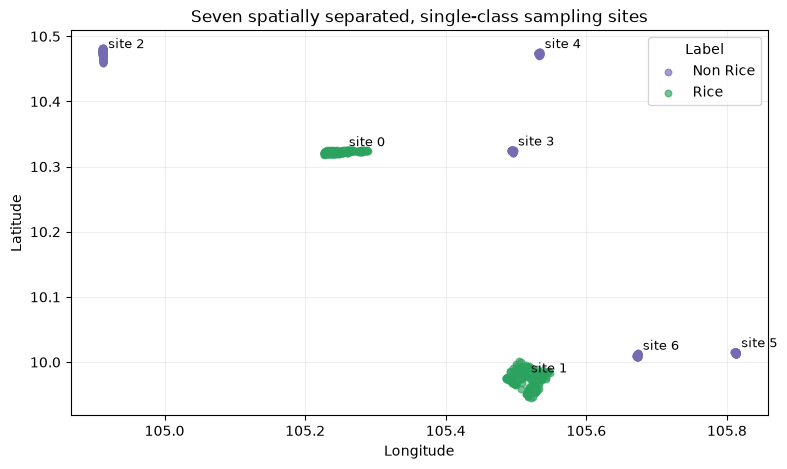
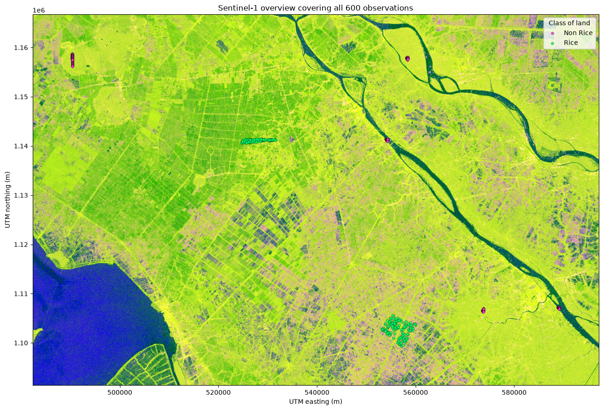
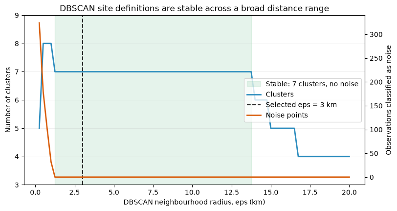
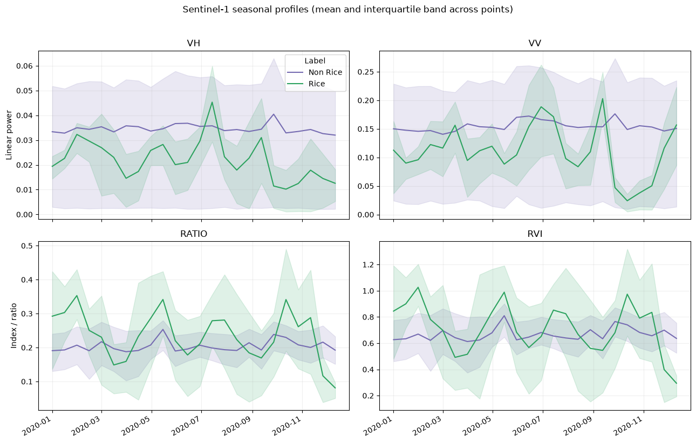
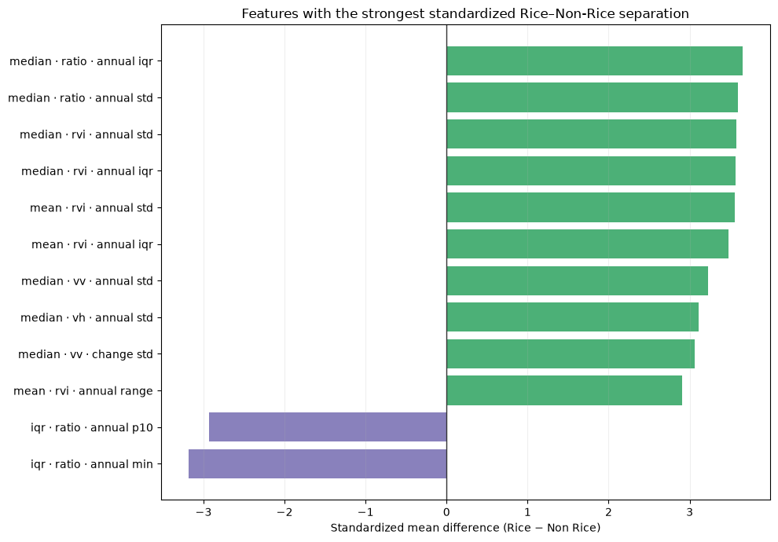
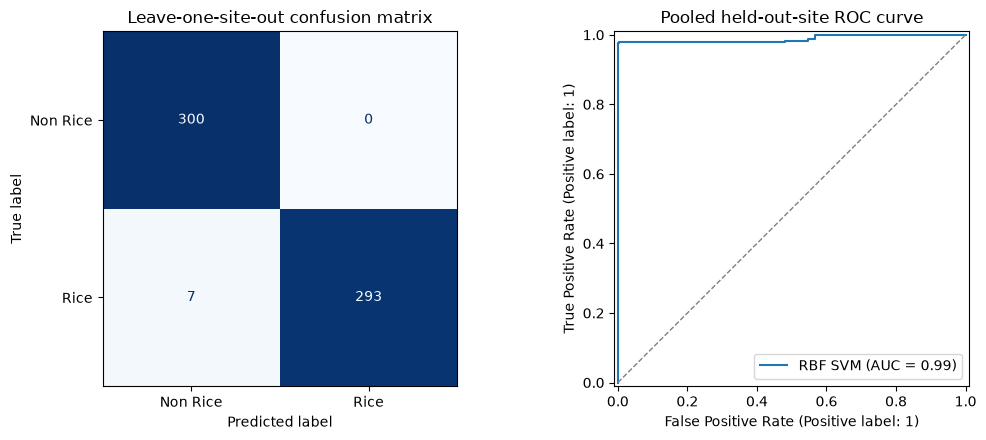

# Rice-crop detection from Sentinel-1 SAR time series

This repository is a compact remote-sensing classification study: given a labelled geographic point, retrieve the surrounding Sentinel-1 radar signal and predict whether the location contains rice. The work combines geospatial sampling, Sentinel Hub data access, temporal feature engineering and leakage-aware model validation.

The central modelling question is not whether latitude and longitude alone identify rice. Coordinates are used only to locate the corresponding satellite pixels. The predictors are spatial and seasonal descriptors derived from Sentinel-1 VH and VV backscatter.

```text
labelled coordinate
        │
        ▼
Sentinel-1 VH/VV time series around the point
        │
        ▼
9 × 9 pixel spatial summaries and radar indices
        │
        ▼
phase-invariant annual phenology features
        │
        ▼
Rice / Non Rice classifier
```

The complete, executed analysis is in [Starting Notebook - Sentinel Hub.ipynb](./Starting%20Notebook%20-%20Sentinel%20Hub.ipynb). A longer implementation record is available in [PROJECT_SUMMARY.md](./PROJECT_SUMMARY.md).

## Study context

Rice mapping is a challenging remote-sensing problem because the radar response of a field changes through flooding, planting, canopy development and harvest. A single acquisition can therefore be ambiguous: rice at one growth stage may resemble water, bare soil or another crop. This study uses a full annual Sentinel-1 time series so the classifier can learn seasonal behaviour rather than depend on one date.

Sentinel-1 synthetic-aperture radar is useful in humid agricultural regions because it operates independently of daylight and is substantially less obstructed by clouds than optical imagery. VH and VV polarizations provide complementary sensitivity to surface and vegetation structure.

## Data

### Labelled point observations

`Crop_Location_Data.csv` contains 600 labelled coordinates:

| Property | Value |
|---|---:|
| Observations | 600 |
| Rice | 300 |
| Non Rice | 300 |
| Spatial sampling sites | 7 |
| Rice sites | 2 |
| Non-rice sites | 5 |

The observations are not 600 geographically independent samples. They form seven dense, widely separated clusters, and every cluster contains only one class. This dependence is important for both exploratory interpretation and validation design.

The CSV does not include a site identifier. Coordinates are projected from WGS84 to the local metric CRS, UTM zone 48N (`EPSG:32648`), and sites are reconstructed using DBSCAN with `eps = 3 km` and `min_samples = 20`. No class labels are used in clustering. The seven-cluster, zero-noise solution remains stable for radii from 1.25 km through 13.75 km.

### Sentinel-1 time series

The notebook retrieves Sentinel-1 Interferometric Wide-swath GRD data through Sentinel Hub with:

- ascending-orbit acquisitions;
- VH and VV polarizations in linear power;
- gamma-zero terrain backscatter (`GAMMA0_TERRAIN`);
- orthorectification using the Copernicus DEM;
- a `dataMask` to distinguish valid and missing pixels; and
- a centred 9 × 9 pixel neighbourhood, approximately 90 m × 90 m at 10 m sampling.

The year 2020 is represented by 25 approximately 15-day request intervals. An interval denotes the temporal search/mosaicking window; it is not a claim that an acquisition occurred exactly on its start date.

For each observation, interval and radar feature family, the cache records the spatial mean, standard deviation, 25th percentile, median, 75th percentile, valid-pixel count and no-data count. Four physical feature families are retained:

- VH backscatter;
- VV backscatter;
- VH/VV ratio; and
- dual-polarization Radar Vegetation Index (RVI).

The reusable cache is stored in `sentinel1_timeseries_2020.csv.gz`:

```text
600 observations × 25 periods × 4 feature families = 60,000 rows
```

Median backscatter is available for 96% of the cached observation-period-feature rows. Missing periods are excluded from annual summaries, while the number of valid periods is itself retained as a feature.

## Accessing Sentinel Hub

Satellite requests use the Copernicus Data Space Ecosystem (CDSE) deployment of Sentinel Hub.

1. [Create or sign in to a CDSE account](https://dataspace.copernicus.eu/).
2. [Register an OAuth client](https://documentation.dataspace.copernicus.eu/APIs/SentinelHub/Overview/Authentication.html) using the client-credentials flow.
3. Install the Python dependencies and open the notebook:

```bash
uv sync
uv run jupyter lab
```

4. Run the credential-configuration cell near the beginning of the notebook. It prompts securely for the client ID and secret and stores a local `cdse` profile through `SHConfig`; credentials are not committed to this repository.

Relevant technical references:

- [Sentinel Hub authentication](https://documentation.dataspace.copernicus.eu/APIs/SentinelHub/Overview/Authentication.html)
- [Sentinel-1 GRD processing options](https://documentation.dataspace.copernicus.eu/APIs/SentinelHub/Data/S1GRD.html)
- [`sentinelhub-py` configuration](https://sentinelhub-py.readthedocs.io/en/latest/configure.html)
- [Process API](https://documentation.dataspace.copernicus.eu/APIs/SentinelHub/Process.html)

The cached time-series file allows most modelling and visualization cells to run without repeating the 175 site-period satellite requests. A live credential is still required to reproduce image downloads or rebuild the cache.

## Feature engineering

Each period first summarizes the local 9 × 9 neighbourhood. Those temporal sequences are then converted into phase-invariant annual descriptors so that two rice regions do not need to share the same planting date. For every radar family and spatial statistic, the notebook computes:

- annual location and dispersion statistics;
- minimum, maximum and range;
- temporal percentiles and interquartile range;
- mean absolute consecutive change;
- maximum rise and fall;
- variability of consecutive changes; and
- valid-period count.

This produces 240 predictors per observation. Latitude, longitude and DBSCAN site ID are deliberately excluded from the model matrix.

## Validation design

A random row split is inappropriate as the primary evaluation because neighbouring samples from every site would appear in both training and testing. Such a split measures interpolation within known sites and allows the model to exploit site-specific conditions.

The primary evaluation is therefore `LeaveOneGroupOut`, where the group is the reconstructed spatial site. Each fold trains on six complete sites and predicts the seventh. The final confusion matrix and ROC curve pool predictions made only while each observation's entire site was absent from training.

All imputation and scaling are contained within each estimator pipeline and are fitted independently inside each training fold.

## Models and results

Four classifiers were evaluated under identical leave-one-site-out folds:

| Model | Accuracy | Balanced accuracy | Macro F1 | Rice F1 | ROC AUC | Average precision |
|---|---:|---:|---:|---:|---:|---:|
| **RBF SVM** | **0.988** | **0.988** | **0.988** | **0.988** | 0.989 | 0.993 |
| Logistic regression | 0.950 | 0.950 | 0.950 | 0.952 | 0.992 | 0.993 |
| Extra Trees | 0.925 | 0.925 | 0.925 | 0.930 | **0.997** | **0.997** |
| Constant non-rice | 0.500 | 0.500 | 0.333 | 0.000 | 0.500 | 0.500 |

The RBF SVM was selected because it achieved the strongest class-balanced prediction at the operating threshold. Extra Trees produced the highest ranking metrics, but its lower thresholded accuracy and macro F1 illustrate that ROC AUC alone does not determine the best operational classifier.

The pooled RBF SVM confusion matrix is:

| Actual \ Predicted | Non Rice | Rice |
|---|---:|---:|
| Non Rice | 300 | 0 |
| Rice | 7 | 293 |

All seven errors are false negatives from rice observations; no non-rice observation was classified as rice. The corresponding overall accuracy is 98.83%, with ROC AUC 0.989 and average precision 0.993.

A conventional stratified 70/30 row split produced 100% accuracy for the same RBF SVM. That number is retained only as a diagnostic demonstration of how much easier within-site interpolation is; it is not the primary generalization estimate.

## Interpretation and limitations

The results provide strong evidence that full-season Sentinel-1 phenology is more informative than the original two-feature, single-date baseline. Rice observations show greater temporal variability in VH, VV and the derived ratio/RVI features, while non-rice profiles are comparatively stable.

The 98.8% score should nevertheless be interpreted as transfer across **these seven sites**, not as universal rice-detection performance. The effective number of independent geographic units is small, only two sites contain rice, and the four candidate models were compared on the same spatial folds. A production study should add multiple independent rice and non-rice regions, additional years and acquisition geometries, and a geographically untouched final test set. Model probabilities and the operational threshold would also require calibration.

## Acknowledgment

This project was completed in response to a technical assessment provided by **CarbonFarm**. Credit goes to CarbonFarm for designing the original challenge and supplying the task context and labelled crop-location dataset. The implementation, extended remote-sensing workflow, visualizations, feature engineering and leakage-aware model evaluation presented here were developed as the candidate's solution to that assessment.

## Key figures

### Raw spatial distribution

All 600 labelled points form seven separated, single-class sampling sites. This structure motivates grouped rather than random-row validation.



### Sentinel-1 overview

The false-colour Sentinel-1 composite covers the complete study extent with an 8 km contextual margin. Point colours indicate the labelled class; the raster colours encode stretched VV, VH and VV−VH responses rather than natural colour.



### Spatial-group sensitivity

The seven-site partition is stable across a broad DBSCAN radius range, supporting its use as a validation grouping rather than an arbitrary parameterization.



### Seasonal radar behaviour

Mean temporal profiles and interquartile bands show that rice has substantially stronger seasonal dynamics, particularly in the latter part of the year. The curves are descriptive aggregates; they are not themselves the validation result.



### Most discriminative annual features

The largest standardized class differences are dominated by annual variability and spread descriptors. These label-aware effect sizes are exploratory; all model evaluation remains site-held-out.



### Held-out-site classification diagnostics

The final panel combines the pooled leave-one-site-out confusion matrix with the RBF SVM ROC curve. Every displayed prediction was generated while its complete spatial site was excluded from model fitting.


